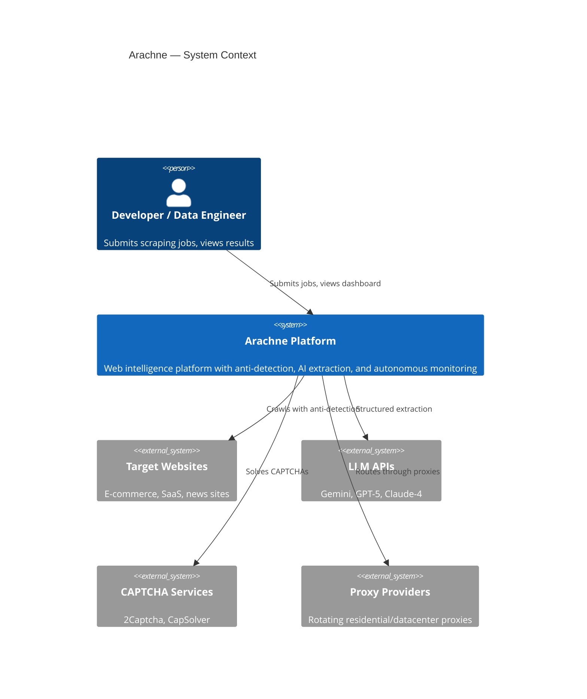
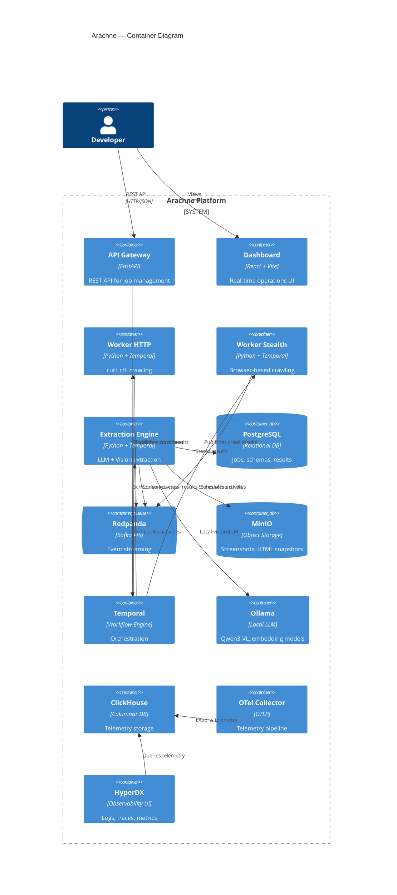
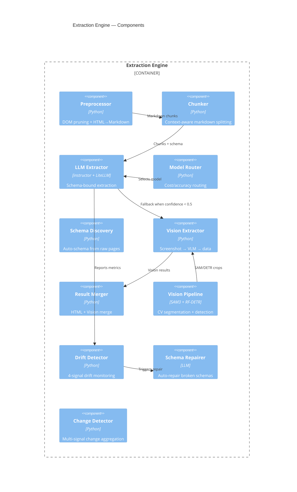
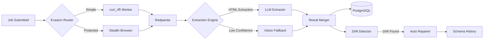

# Architecture

> C4 Model for the Arachne Web Intelligence Platform

## Context Diagram (Level 1)



## Container Diagram (Level 2)



## Component Diagram (Level 3) — Extraction Engine



## Package Structure

```
Arachne/
├── apps/
│   ├── api-gateway/         # FastAPI REST API
│   ├── dashboard/           # React + Vite command center
│   ├── extraction-engine/   # AI extraction Temporal worker
│   ├── worker-http/         # curl_cffi HTTP crawling
│   └── worker-stealth/      # Browser-based crawling
├── packages/
│   ├── extraction/          # Core extraction library
│   │   ├── vision/          # SAM 3 + RF-DETR pipeline
│   │   ├── drift/           # Schema drift detection
│   │   ├── change/          # Change detection engine
│   │   └── captcha/         # CAPTCHA solving
│   ├── observability/       # OTel, metrics, logging, DuckDB
│   ├── stealth/             # Anti-detection evasion engine
│   └── storage/             # MinIO + PostgreSQL clients
├── infra/
│   ├── docker-compose.yml   # Full stack: 12+ services
│   └── otel-collector-config.yaml
├── benchmarks/              # Performance comparison scripts
└── docs/
    └── adr/                 # Architectural Decision Records
```

## Technology Stack

| Layer | Technology | Why |
|-------|-----------|-----|
| HTTP Crawling | curl_cffi | JA4 fingerprint spoofing, HTTP/2 |
| Browser Crawling | Camoufox, Pydoll | Anti-fingerprinting stealth |
| Evasion Router | Custom | Adaptive strategy selection |
| Extraction | instructor + LiteLLM | Schema-bound Pydantic output |
| Vision | SAM 3, RF-DETR, Qwen3-VL | Multi-model CV pipeline |
| Orchestration | Temporal | Deterministic workflow engine |
| Messaging | Redpanda | Kafka API, no JVM |
| Storage | PostgreSQL + MinIO | Structured + object storage |
| Observability | ClickHouse + HyperDX | ClickStack telemetry |
| Dashboard | React + Vite | Real-time operations UI |
| Local AI | Ollama | Self-hosted vision models |

## Data Flow


